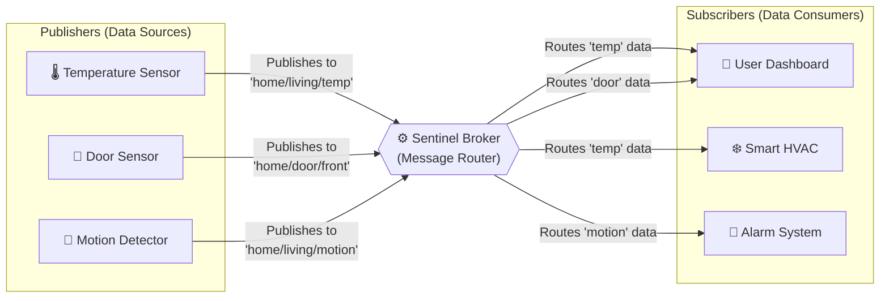
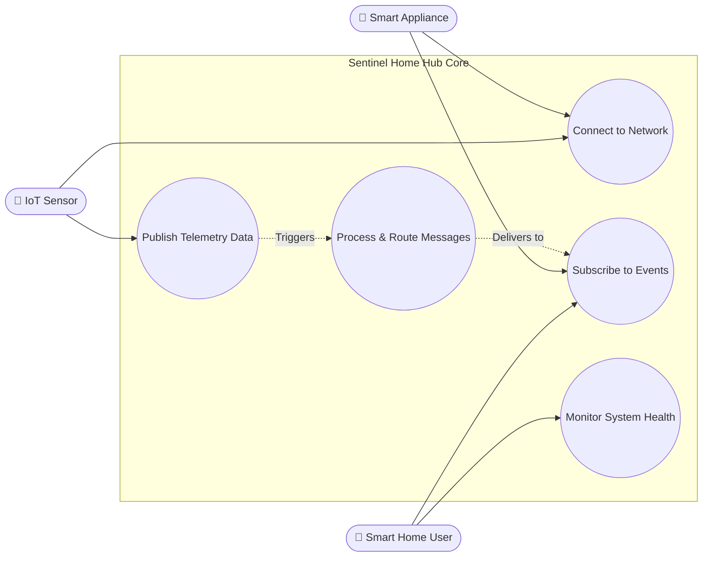
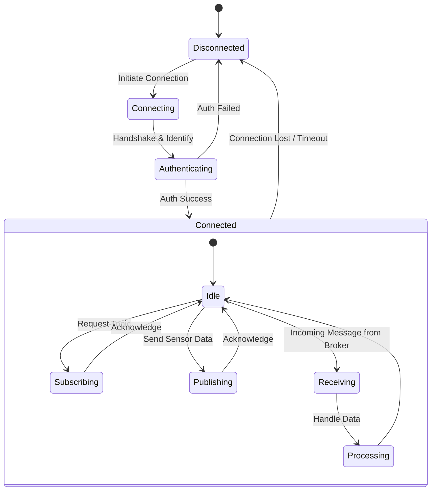

# Sentinel Home Hub
**A Computer Networks Project**

Sentinel Home Hub is a lightweight, efficient Publisher/Subscriber (Pub/Sub) messaging system designed specifically for Smart Home environments. The project aims to build a centralized broker that facilitates low-latency, reliable communication between various IoT devices, sensors, and user interfaces within a local network.

As an educational project, the core focus is on implementing fundamental networking concepts, custom communication protocols, and efficient message routing algorithms from scratch.
---

## 🏗️ Architecture Overview

The system is built on a classic **Broker-centric Publisher/Subscriber** model. This architecture decouples the devices producing data from the devices consuming data, allowing for a highly scalable and flexible network.

- **Central Broker:** The heart of the Sentinel Home Hub. It manages connections, maintains a registry of topics, and routes incoming messages from publishers to the correct subscribers.
- **Publishers:** Devices or sensors (e.g., temperature sensors, motion detectors) that generate data and push it to the broker under specific "topics".
- **Subscribers:** Applications or actuators (e.g., smart thermostats, user dashboards) that express interest in certain topics and receive updates from the broker whenever new data is published.
---

## 📊 System Diagrams

### 1. High-Level Communication Flow

This diagram illustrates the basic flow of data from sensors (Publishers) through the Sentinel Broker to the end devices (Subscribers).

### 2. Use Case Diagram

This diagram outlines the primary interactions different entities (actors) will have with the Sentinel Home Hub system.

### 3. Basic Activity Flow

This diagram represents the planned lifecycle and activity flow of a standard client (device) connecting to the Sentinel network.

---

## 🚀 Planned Specifications

The fundamental technical specifications targeted for this project include:

*   **Custom Application Protocol:** Designing a lightweight, binary-based or structured text protocol over TCP/IP to minimize overhead for constrained IoT devices.
*   **Topic-Based Routing:** Implementing a hierarchical topic matching engine (e.g., `home/livingroom/temperature`) to efficiently filter and route messages.
*   **Concurrent Connection Handling:** Utilizing non-blocking I/O or multi-threading architectures to handle multiple simultaneous publisher and subscriber connections without bottlenecks.
*   **Quality of Service (QoS):** Implementing basic delivery guarantees to ensure critical messages (like security alerts) are not lost during network fluctuations.
*   **Fault Tolerance:** Designing the broker to gracefully handle unexpected client disconnects and malformed packets.

---
*Note: This README reflects the initial planning phase. Features, specifications, and architecture are subject to evolve as the project development progresses.*
