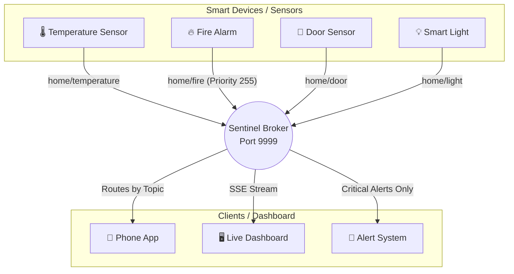
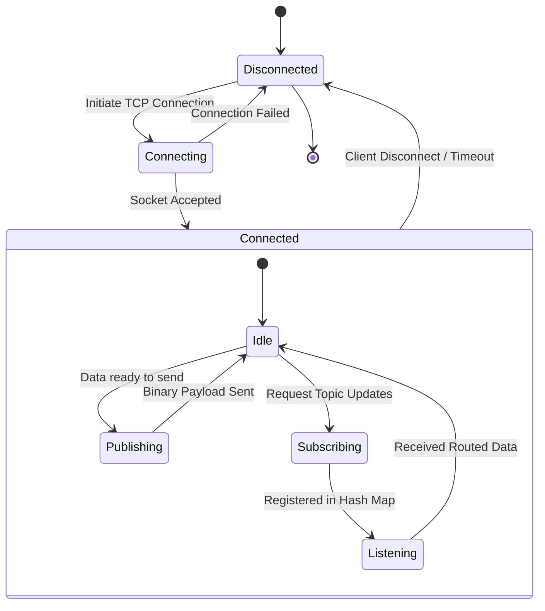
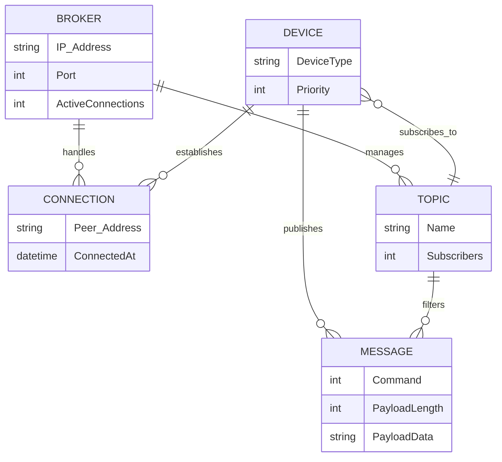
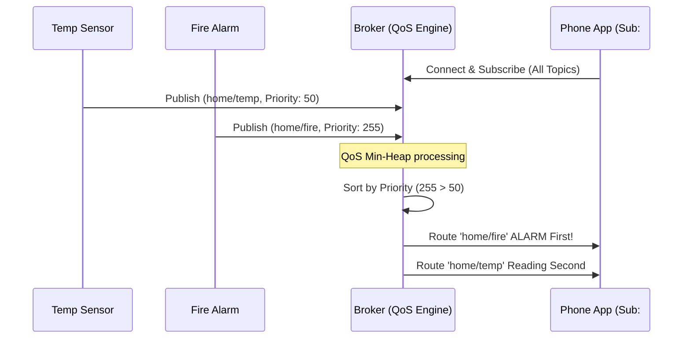
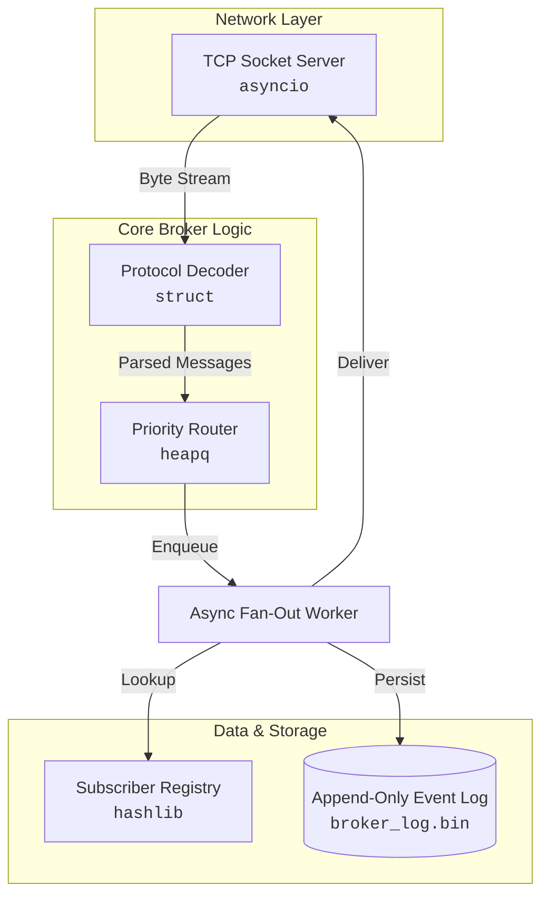

#  Smart Home Hub — Pub/Sub Message Broker

A **zero-dependency**, high-performance Publish/Subscribe message broker for IoT smart home devices, built entirely on Python's standard library.

> "The brain of a smart home — routes critical alerts first, remembers every event forever, and lets you time-travel to any moment in history."

---

## Features

| Feature | Description |
|---------|-------------|
| **Async TCP Server** | Built on `asyncio.start_server` — handles 1000+ concurrent device connections |
| **Custom Binary Protocol** | 10-byte fixed header + payload via `struct` — 53% smaller than JSON |
| **Priority-Aware QoS** | `heapq` min-heap with negated priority — fire alarms (255) always before battery updates (0) |
| **Event-Sourced Log** | Append-only binary log (`broker_log.bin`) — every event persisted before routing |
| **Time-Travel Replay** | Seek to any byte offset in the log, replay history, then switch to live |
| **Live Visualization** | Canvas-based animated network topology with real-time particle effects |
| **Protocol Inspector** | See raw hex bytes decoded in real-time — proves the binary protocol works |
| **IoT Device Simulator** | 4 simulated smart home devices publishing realistic data |
| **Zero Dependencies** | Only Python standard library — `asyncio`, `struct`, `heapq`, `hashlib`, file I/O |

---

## Architecture

```
    🌡️ Temperature     🔥 Fire Alarm     🚪 Door Sensor     💡 Smart Light
       │                   │                 │                    │
       │ TCP               │ TCP             │ TCP                │ TCP
       ▼                   ▼                 ▼                    ▼
   ┌──────────────────────────────────────────────────────────────────┐
   │                    SMART HOME HUB (Broker)                       │
   │                    Port 9999 (TCP)                                │
   │                                                                   │
   │  ┌────────────┐   ┌────────────┐   ┌─────────────────┐          │
   │  │ TCP Server │──▶│  Protocol  │──▶│ Priority Router │          │
   │  │ (Accepts   │   │  Decoder   │   │ (QoS Engine)    │          │
   │  │ devices)   │   │ (Binary)   │   │ Fire > Battery  │          │
   │  └────────────┘   └────────────┘   └───────┬─────────┘          │
   │                                            │                     │
   │                         ┌──────────────────┘                     │
   │                         ▼                                        │
   │  ┌────────────┐   Fan-Out to                                     │
   │  │ Event Log  │   All Subscribers ──▶ 📱 Phone App               │
   │  │ (History)  │                    ──▶ 🖥️ Dashboard              │
   │  │ broker.bin │                    ──▶ 🔔 Alert System           │
   │  └────────────┘                                                  │
   └──────────────────────────────────────────────────────────────────┘
```

---

##  System Diagrams (Mermaid)

The following diagrams provide a visual breakdown of the Sentinel Home Hub's internal workings, connections, and lifecycle. These will automatically render on GitHub.

### 1. High-Level Communication Flow
Illustrates the flow of messages from publisher devices to the broker, and finally to the subscribed clients.



### 2. Activity Diagram: Device Lifecycle
Shows the sequence of states a device goes through when interacting with the broker.



### 3. Entity-Relationship (ER) Diagram
Maps out the relationships between connections, devices, topics, and the broker.



### 4. Sequence Diagram: Priority Pub/Sub
Demonstrates how the broker processes a critical fire alarm over a routine battery update.



### 5. Component Architecture
A breakdown of the internal Python modules inside the Sentinel Hub.



---

## Quick Start — Full Demo (3 Terminals + Browser)

### Prerequisites

- Python 3.10+ (no pip installs needed)

### Step 1: Start the Broker

```bash
python main.py
```

You should see:

```
Broker listening on ('127.0.0.1', 9999)
```

### Step 2: Start the Dashboard Server

Open a **new terminal** and run:

```bash
python dashboard_server.py
```

You should see:

```
Dashboard Server listening on http://127.0.0.1:8080
Proxy connected to broker.
Subscribed to 6 topics.
```

### Step 3: Open the Visualization Dashboard

Open your browser and go to:

```
http://127.0.0.1:8080
```

You will see the **Live Architecture Visualization** with:
- Network topology (4 publishers → Broker → 3 subscribers)
- Throughput chart
- Priority Queue
- Device control buttons
- Protocol Inspector
- Live Message Feed

The status indicator should show **🟢 Broker Connected**.

### Step 4: Start the IoT Device Simulator

Open a **third terminal** and run:

```bash
python smart_home_simulator.py
```

You should see:

```
 Smart Home IoT Device Simulator
Devices:
  🌡️  Temperature Sensor  (every 2s,   priority 50)
  🔥  Fire Alarm          (every 30s,  priority 10/255)
  🚪  Door Sensor         (every 5-15s, priority 128)
  💡  Smart Light         (every 8-20s, priority 30)
```

**Now watch the dashboard** — you'll see:
- **Animated particles** flowing from sensor nodes → broker → subscriber nodes
- **Messages appearing** in the live feed, color-coded by priority
- **Priority Queue** sorting messages (highest priority first)
- **Protocol Inspector** showing raw hex bytes of each message
- **Throughput chart** tracking messages per second

---

## Interactive Demo Features

###  Device Control Buttons

Click buttons in the **Simulate Devices** panel to manually trigger IoT events:

| Button | What It Does | Priority |
|--------|-------------|----------|
| 🔥 **Fire Alarm** | Publishes a fire alert to `home/fire` | 255 (critical) |
| 🌡️ **Temperature** | Publishes a random temperature reading to `home/temperature` | 50 (low) |
| 🚪 **Door** | Publishes a door open event to `home/door` | 128 (medium) |
| 💡 **Light** | Publishes a light status to `home/light` | 30 (low) |
| 💣 **QoS Burst** | Sends 50 fire alarms + 200 battery updates simultaneously | Mixed |

When you click a button, watch the **animated particle** travel from the device node → broker → all subscribers.

###  Protocol Inspector

The bottom-left panel shows the **raw binary protocol** of the last message:

```
02 4E EC 8F 19 FF 00 00 00 20 F0 9F 94 A5 20 46
49 52 45 20 44 45 54 45 43 54 45 44 20 69 6E 20
73 65 63 74 6F 72 20 37 47 21

CMD     0x02 (PUBLISH)
TOPIC   0x4EEC8F19 → home/fire
PRI     0xFF (255)
LENGTH  0x00000020 (32 bytes)
PAYLOAD "🔥 FIRE DETECTED in sector 7G!"
TOTAL   42 bytes (JSON: ~80 bytes → 48% smaller)
```

###  Time-Travel Replay

Time-Travel lets you **replay historical messages** from the binary event log.

**How to use it:**

1. In the dashboard, find the **Time-Travel** panel (bottom of the sidebar)
2. **Drag the slider** to choose a byte offset in the log file (0 = beginning of history)
3. Click **⏪ Replay History**
4. Watch the results appear in **three places simultaneously**:
   - **Live Message Feed** — historical messages appear with a **dashed border** and faded style to distinguish them from live messages
   - **Network Topology** — animated particles replay through the system
   - **Priority Queue** — replayed messages appear sorted by priority

**Demo tip:** After running the simulator for a minute, stop it, then use Time-Travel to replay everything from offset 0. You'll see the entire history flow through the visualization.

**From the CLI (alternative):**

```bash
python -m client.client time-travel --topic home/fire --offset 0
```

This replays all historical fire alarm messages from the beginning of the log, then switches to live mode.

---

## Smart Home Topics

| Topic | Device | Priority | Description |
|-------|--------|----------|-------------|
| `home/temperature` | 🌡️ Temperature Sensor | 50 | Routine temperature readings |
| `home/fire` | 🔥 Fire Alarm | 255 | Critical fire alerts |
| `home/door` | 🚪 Door Sensor | 128 | Door open/close events |
| `home/light` | 💡 Smart Light | 30 | Light on/off status |
| `home/battery` | 🔋 Battery Monitor | 0 | Battery level updates |
| `broker/metrics` | 📊 Internal | 255 | Broker throughput stats |

---

## Wire Protocol

```
 0      1         5    6         10        10+N
 ┌──────┬─────────┬────┬─────────┬──────────────┐
 │ CMD  │ TOPIC   │PRI │ PAY_LEN │   PAYLOAD    │
 │ u8   │ u32 BE  │ u8 │ u32 BE  │  N bytes     │
 └──────┴─────────┴────┴─────────┴──────────────┘
```

| Command | Code | Description |
|---------|------|-------------|
| Subscribe | `0x01` | Register for a topic |
| Publish | `0x02` | Send a message to a topic |
| Time-Travel | `0x03` | Replay from a log offset, then go live |

**Network byte order** (big-endian) — works across ARM (Raspberry Pi) and x86 (laptop).

---

## Project Structure

```
CNProject/
├── broker/                         # Core broker package
│   ├── __init__.py
│   ├── server.py                   # TCP server + connection registry
│   ├── protocol.py                 # Binary codec (struct pack/unpack)
│   ├── router.py                   # Priority queue + async fan-out worker
│   └── storage.py                  # Event log + time-travel replay
├── client/                         # Client tools
│   ├── __init__.py
│   ├── client.py                   # CLI client (subscribe/publish/time-travel)
│   ├── dashboard.py                # Dynamic web client (SSE-based)
│   └── index.html                  # Dynamic web client UI
├── visualization/                  # Live Architecture Dashboard
│   ├── index.html                  # Dashboard layout
│   ├── styles.css                  # Premium dark theme + animations
│   └── app.js                      # Canvas topology, particles, SSE, controls
├── tests/                          # Test suite
│   ├── test_protocol.py            # Binary codec tests
│   ├── test_router.py              # Priority routing tests
│   ├── test_storage.py             # Event log tests
│   └── test_integration.py         # End-to-end integration tests
├── main.py                         # Broker entry point
├── dashboard_server.py             # Dashboard proxy server (SSE + REST)
├── smart_home_simulator.py         # IoT device simulator (4 devices)
├── simulate_load.py                # QoS load test (burst mode)
└── broker_log.bin                  # Binary event log (auto-created)
```

---

## CLI Client Usage

### Subscribe to a Topic

```bash
python -m client.client subscribe --topic home/fire
```

### Publish a Message

```bash
python -m client.client publish --topic home/fire --priority 255 --message "FIRE DETECTED!"
```

### Interactive Publishing

```bash
python -m client.client publish-interactive --topic home/temperature --priority 50
# Type messages and press Enter. Ctrl+C to quit.
```

### Time-Travel (Replay from CLI)

```bash
python -m client.client time-travel --topic home/fire --offset 0
```

---

## Running Tests

```bash
python -m pytest tests/ -v
```

---

## Alternative Dashboard (Dynamic Web Client)

There is also a **Dynamic Web Client** that lets you subscribe to any topic and publish messages from the browser:

```bash
python client/dashboard.py
# Open http://127.0.0.1:8080
```

This creates a **per-browser-tab TCP connection** to the broker — each tab can subscribe to different topics independently.

---

## Dependencies

**None.** This project uses only Python's standard library:

- `asyncio` — async TCP server and event loop
- `struct` — binary protocol serialization
- `heapq` — priority queue (min-heap)
- `hashlib` — topic string → 32-bit hash
- `os` / file I/O — append-only event log
- `json` — SSE event formatting (dashboard only)

---

## CN Concepts Demonstrated

| Layer | Concept | Implementation |
|-------|---------|---------------|
| **Transport** | TCP Sockets | Persistent device connections on port 9999 |
| **Transport** | Reliable Delivery | TCP guarantees fire alarms arrive |
| **Transport** | Multiplexing | Single event loop handles all connections |
| **Application** | Custom Protocol | 10-byte binary header (like MQTT) |
| **Application** | Network Byte Order | Big-endian for cross-platform (ARM ↔ x86) |
| **Application** | Framing | Length-prefix tells where messages end |
| **QoS** | Priority Scheduling | Min-heap with negated priority, FIFO tie-breaking |
| **QoS** | Fan-Out | One fire alarm → all subscribers simultaneously |
| **Storage** | Event Sourcing | Complete history in append-only binary log |
| **Storage** | Write-Ahead Logging | Event saved before routing (crash-safe) |
| **Storage** | `lseek()` / `seek()` | Random access for time-travel replay |
| **Web** | HTTP Server | Hand-written (no Flask/Django) |
| **Web** | Server-Sent Events | Real-time push to browser dashboard |
| **Web** | Proxy Pattern | Dashboard bridges browser ↔ broker |