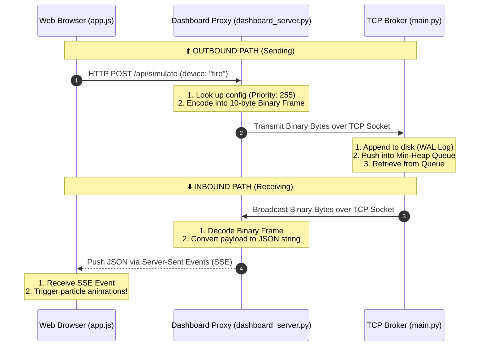

# Round-Trip Data Flow: UI to Broker and Back

When you click a simulation button on the frontend, the data makes a lightning-fast round trip through three different layers. 

Here is a visual map of exactly how that information flows:

### Key Takeaway
Notice how the **Dashboard Proxy** is the middleman protecting the browser. The browser only ever speaks modern web protocols (HTTP/JSON/SSE). The Dashboard Proxy handles the translation to and from your hardcore, custom binary TCP protocol on the fly!
